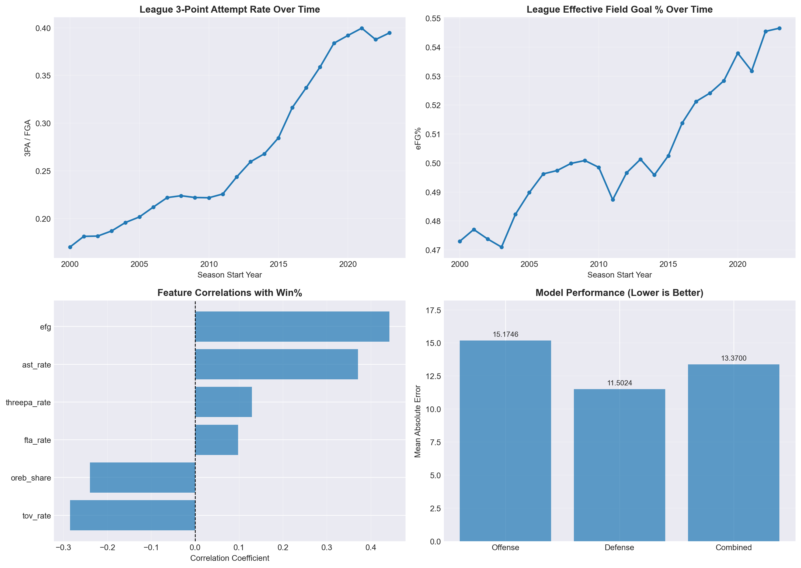
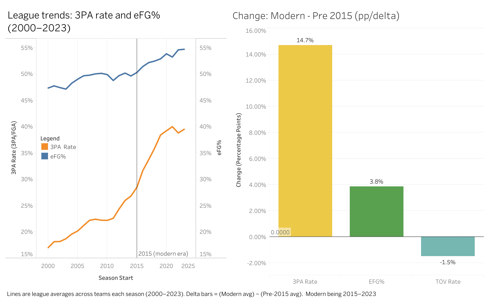

# NBA Team-Season Modeling (2000–2023)

This project analyzes NBA team-season performance using engineered efficiency features and simple predictive models.

# Why I made this

This project builds a Tableau-ready NBA team-season dataset and a set of interpretable, 
time-safe models to explain what drives winning and to benchmark team performance relative to payroll expectations 
(a practical “value” lens for comparing front-office efficiency across seasons).

## Executive summary
- **Coverage:** Regular season 2000–2023 (716 team-seasons); **playoffs 2000–2020 (626 team-seasons)**; **payroll 2000–2021 (656 team-seasons)**.
- **Best single relationship with win%:** **eFG% (r = 0.442)**.
- **Best win% model (stats-only):** **Defense feature set, MAE = 11.50 pp** (vs Offense 15.17 pp, Combined 13.37 pp).
- **Payroll adds signal (restricted seasons):** **Combined+Payroll MAE = 10.73 pp** (best with payroll).
- **Playoffs link:** **regular-season win% vs playoff wins r = 0.696**.

## Decision support (how this can be used)
- Identify the efficiency levers most associated with winning (roster construction / player archetypes).
- Benchmark teams’ outcomes **relative to payroll expectations** (front office “value” lens).
- Compare how the “winning formula” shifts across eras (strategy evolution).
# What this does:
- Loads regular-season team stats (2000–2023) and builds efficiency features (eFG%, turnover rate, 3PA rate, FT rate, etc.).
- Evaluates Ridge regression models with a time-based split (no training on future seasons).
- Merges payroll and playoff results when those source files cover the selected season range (coverage depends on the CSV sources).
- Writes a single enriched team-season CSV (including engineered rates, playoffs, and payroll fields) for Tableau and downstream analysis.
- Adds two extensions:
  - **Payroll value (net of team stats):** flags teams that win more/less than expected given payroll + efficiency metrics.
  - **Era split:** compares model performance and feature importance pre-2015 vs the modern NBA.

## Repo structure

```text
README.MD
├── nba_analysis.py
├── requirements.txt
├── .gitignore
├── tableau
│   ├── nba_dashboards.twbx
│   ├── Modern_vs_past_nba.png
│   └── NBA_Value.png
├── repo_assets
│   └── league_trends_and_models.png
├── data
│   ├── README.md
│   └── raw
│       ├── nba_team_stats_00_to_23.csv
│       ├── nba_team_stats_playoffs_00_to_21.csv
│       └── nba_team_payroll_1990_to_2023.csv
└── outputs
    └── (generated artifacts)
```

## Data

Raw CSVs are included in `data/raw/` (CC0 / Public Domain). Full citations and links are in `data/README.md`.

## Results

Running the script writes the following artifacts to `outputs/`:
- `outputs/nba_team_seasons_enriched.csv` — one merged/enriched dataset for Tableau and downstream analysis
- `outputs/figures/league_trends_and_models.png` — summary figure saved to disk

Note: payroll and playoff merges do not cover every season in the regular-season dataset. When results are described as “restricted,” they are computed only on the subset of seasons where payroll exists (no imputation of missing payroll years).

## Payroll value lens (how to interpret it)

Residuals are computed from the payroll+stats value model:

- `win_pct_residual = actual win% (pp) − expected win% (pp)`
- **Positive residual** → outperformed expectation given spending + efficiency stats
- **Negative residual** → underperformed expectation given spending + efficiency stats

### Notable examples

**Top value team-seasons (won more than payroll+stats predicts):**
- Chicago Bulls (2004): **+25.8 pp**
- Indiana Pacers (2013): **+25.8 pp**
- Portland Trail Blazers (2013): **+24.8 pp**
- Chicago Bulls (2011): **+23.8 pp**
- Portland Trail Blazers (2014): **+22.9 pp**

**Bottom value team-seasons (won less than payroll+stats predicts):**
- Phoenix Suns (2018): **−24.8 pp**
- Memphis Grizzlies (2006): **−23.7 pp**
- Philadelphia 76ers (2015): **−23.7 pp**
- Miami Heat (2007): **−23.7 pp**
- Golden State Warriors (2009): **−23.5 pp**

**Most recent payroll season (2021) value leaders:**
- Best: Miami Heat **(+14.6)**, Dallas Mavericks **(+13.6)**, Phoenix Suns **(+12.7)**
- Worst: Indiana Pacers **(−22.2)**, Houston Rockets **(−18.6)**, Los Angeles Lakers **(−18.5)**


Key takeaways:
- Shooting efficiency (**eFG%**) is consistently one of the strongest predictors of win%.
- Payroll adds signal in the modern era (where available), reducing prediction error vs stats-only models.
- Feature importance shifts across eras (pre-2015 vs modern NBA).


## Restrictions & limitations

This analysis is team-season level and uses public aggregates. Results should be interpreted as **associational** (not causal) and may be impacted by factors not represented in the dataset.

**Unmodeled factors (not in the features):**
- **Player availability & injuries:** missed games by key players can change win% without fully reflecting in season-level rates.
- **Coaching and scheme changes:** systems, rotations, and defensive schemes can shift outcomes beyond team-level rates.
- **Superstar concentration / top-end talent:** late-game shot creation and matchup advantages aren’t captured by season aggregates.
- **Rookie-scale and bargain contracts:** payroll can understate “true talent cost” when elite players are on rookie deals/discounted contracts.
- **Mid-season trades & roster churn:** team-season aggregates blend multiple roster configurations and hide inflection points.
- **Schedule strength and conference effects:** win% is not adjusted for opponent quality or schedule difficulty.
- **Playoff context:** bracket path, health, and matchups strongly affect playoff wins.

**Methodology / measurement constraints:**
- **Estimated possessions (rate denominators):** possessions are not directly provided in the raw dataset, so they are estimated using a common approximation:
  - `possessions = 0.96 * (FGA + TOV + 0.44 * FTA − OREB)`  
    Because multiple engineered features use possessions as a denominator, approximation error can propagate into per-possession rates and affect coefficients and error metrics. The constants (0.96 and 0.44) are league-level heuristics and may not perfectly reflect team/era-specific differences.
- **Aggregation effects:** season averages can hide variance (clutch performance, garbage time, matchup effects). Two teams with similar averages can have different win outcomes.

**Data coverage constraints:**
- Payroll is available for **2000–2021**, and playoff outcomes for **2000–2020** in the merged dataset; analyses labeled **restricted** use only seasons with payroll present (no imputation).
- Short/lockout seasons exist (e.g., **2011, 2019**); rate metrics are more comparable than totals in those years.
## Modeling notes

- Models use **Ridge regression (L2 regularization)** to keep coefficients stable when features are correlated.
- Win% error is reported as **MAE in percentage points (pp)** (e.g., 8.5 pp = average absolute error of 8.5% in win rate).
- In the enriched dataset, `win_percentage` is stored as a 0–1 fraction, while `win_pct_pp` is the same value expressed as 0–100 for visualization.
- Payroll models are evaluated on a **restricted** subset of seasons where payroll exists, so comparisons are apples-to-apples.
- Payroll is standardized within each season as `payroll_z_by_season` (relative spending, comparable across eras).

## Preview



(Generated by `python nba_analysis.py`.)

## Tableau dashboards

The Tableau workbook is included in `tableau/nba_dashboards.twbx`. It contains two dashboards:

- **Modern vs past NBA**: league-average trends (eFG% and 3PA rate) plus a pre-2015 vs modern delta (percentage-point change) summary.
- **NBA Value (Wins vs Payroll with Residual)**: payroll (z-score within season) vs win% residual (pp), with Top 10 / Bottom 10 over- and under-performers for a selected season.

### Interactive versions (Tableau Public)

- **Modern vs past NBA**: https://public.tableau.com/views/Dashboard1forNBA/Modernvspastnba
- **NBA Value (Wins vs Payroll with Residual)**: https://public.tableau.com/app/profile/eric.krog/viz/Dashboard1forNBA/NBAValueWinsvsPayrollwithResidual

### Dashboard previews

[](https://public.tableau.com/views/Dashboard1forNBA/Modernvspastnba)

[](https://public.tableau.com/app/profile/eric.krog/viz/Dashboard1forNBA/NBAValueWinsvsPayrollwithResidual)

## Enriched dataset columns (highlights)

- `payroll_z_by_season`: payroll standardized within each season (z-score within season; makes spending comparable across eras).
- `win_pct_pp`: win percentage expressed in percentage points (0–100) for visualization.
- `win_pct_expected`: expected win% (pp) from the payroll+stats value model (only populated where payroll is available; otherwise NA).
- `win_pct_residual`: actual − expected win% (pp); positive = outperformed expectation (NA when expected is NA).
- `plus_minus_per_game`: point differential per game (regular season).
- `po_games`, `po_wins`: playoff games and playoff wins for that team-season (where available).
- `po_data_available`, `payroll_available`: indicators for whether playoff/payroll data is present for that row.
- `payroll_per_win`: payroll divided by regular-season wins (only defined when payroll is available and wins > 0).

## How to run

1) Install dependencies:
```bash
pip install -r requirements.txt
```

2) Run the analysis:
```bash
python nba_analysis.py
```


## AI use

I used AI tools for code cleanup/formatting and for drafting README text. All analysis, engineering decisions, and final code were reviewed and tested by me.
